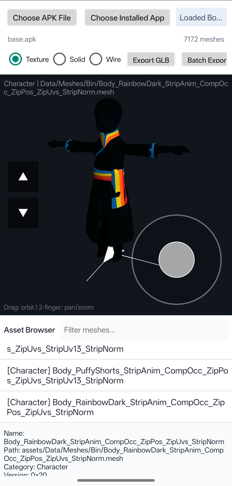

# Sky Model Viewer (Android 版)

[](https://developer.android.com/)
[](https://www.java.com/)

---

## 📖 项目简介

**Sky Model Viewer** 是一款运行在 **Android 平台**上的 3D 模型查看工具。仅支持模型(mesh0x20，meshes0x3c)它是原 Windows 桌面版（基于 WPF/.NET 9）的社区移植版本，专为移动设备优化。

本应用旨在为《光·遇》的爱好者与内容创作者提供一个便捷的移动端解决方案，用于**安全、只读地**浏览本地游戏网格文件。

> **⚠️ 重要提示**：本项目是一个**查看器（Viewer）**，**不是**提取器（Extractor）或编辑器（Editor）。它不包含任何游戏代码、资源文件，也无法导出或修改游戏资产。

---

## 📸 功能预览



---

## ✨ 主要功能

*   **本地文件浏览**：扫描并索引你设备上合法安装的《光·遇》本地文件目录（或解压的资产树）。
*   **3D 模型预览**：在简洁的移动端 3D 视口中，预览受支持的静态网格模型。
*   **元数据查看**：便捷地查看模型顶点数、面数、UV 数据、骨架数量、材质名称及推断的比例尺等信息。
*   **材质与纹理解析**：解析常见的材质定义，并支持显示特定格式（如 BC4/BC7 KTX）的纹理。
*   **移动端适配**：针对 Android 触摸操作进行了界面与交互优化。

---

## 🚧 项目状态与局限性

*   **状态**：此为社区维护的移植版本，处于持续开发中。
*   **格式支持**：对网格、材质、着色器、纹理的解析**尚不完善**，基于对部分本地文件格式的逆向工程实现。
*   **平台限制**：目前仅支持 **Android** 平台。原 Windows 版本需要 .NET 9 SDK 构建。
*   **不包含任何游戏文件**：你必须自行提供合法的本地游戏安装路径。

---

## ⚖️ 法律声明

*   **独立性**：本项目和其贡献者**独立于 thatgamecompany**，与该公司及其产品**没有隶属、背书或赞助关系**。
*   **知识产权**：《光·遇》（*Sky: Children of the Light*）及相关名称、商标、游戏代码和游戏资产，均归其各自所有者（thatgamecompany）所有。
*   **使用限制**：本仓库**不包含** thatgamecompany 的任何游戏代码、二进制文件、模型、纹理、音频、关卡或其他游戏资产。工具仅读取用户设备上已有的文件，供应用内本地查看。
*   **用户责任**：**请仅将本项目用于你拥有合法访问权限的文件。** 本自述文件不构成法律建议。

---

## 📥 下载与安装

你可以在右侧的 **[Releases](https://github.com/XianXiaoWei/SkyModelViewer-Android/releases)** 页面下载最新的 APK 安装包。

---

## 🛠️ 构建与开发

如果你希望从源代码构建此项目：

1.  **克隆仓库**
    ```bash
    git clone https://github.com/XianXiaoWei/SkyModelViewer-Android.git
    ```
2.  **使用 Android Studio** 打开项目。
3.  同步 Gradle 并构建 APK。

---

## 🤝 贡献与反馈

由于是个人维护的移植项目，目前可能有很多不完善的地方。欢迎通过 **[Issues](https://github.com/XianXiaoWei/SkyModelViewer-Android/issues)** 页面提出建议或报告问题。

---

## 📧 联系方式

*   **作者**：XianXiaoWei
*   **邮箱**：3661380498@qq.com

---

## 📜 许可证

本项目为个人学习与研究目的开源，具体许可协议请参见项目根目录的 `LICENSE` 文件（若有）。若无明确声明，默认保留所有权利。

---

**最后更新**：2026年7月11日
